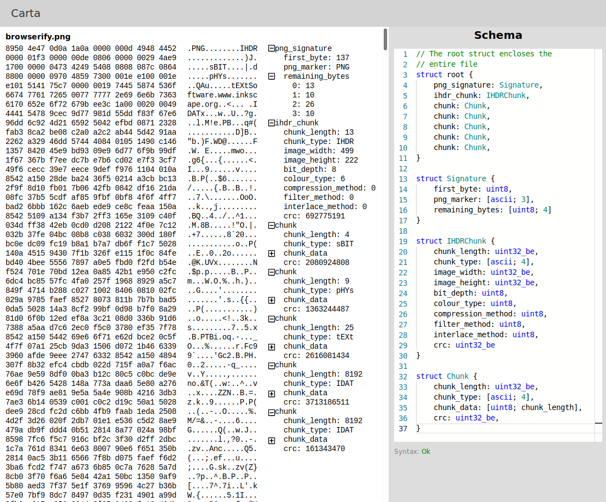

# carta

Binary file explorer and visualiser.  Try it [here](https://jubulani.github.io/)

___

## Build instructions
1. Clone the repo
2. Install a newish version of *stable* rust (v1.31+)

`curl https://sh.rustup.rs -sSf | sh `

3. Configure current shell to run rust

`source $HOME/.cargo/env `

4. Install dependencies

`npm install`

## To run the dev version (including watching for changes in `.ts` and `.rs` files)
`npm run dev`

:tada:
